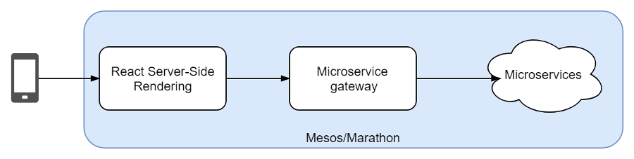
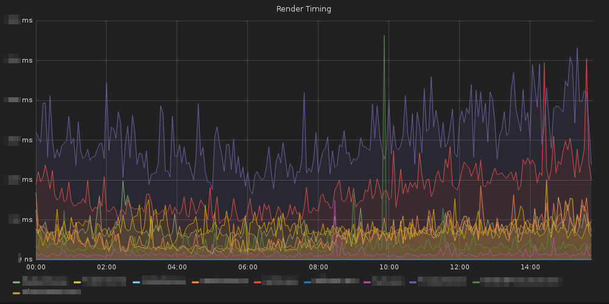
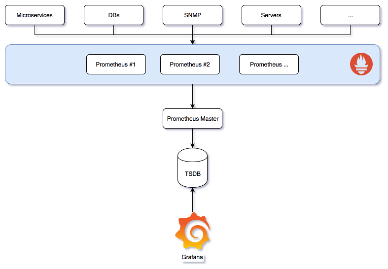

# How Prometheus helped roll out with confidence our new mobile site to millions of customers

At Cdiscount, we always love finding new tools and technologies that can help us oversee our platform, understand what's happening and prevent outages. Last year while working on our new mobile website, the new architecture challenged our operational team in understanding and monitoring those new components.


Historically, we've been using Zabbix to manage our supervising, alerting and on-call duties for a few thousands servers across two datacenters in a mostly static architecture. With the move to Docker and Mesos/Marathon (an alternative container orchestration platform) and the new mobile website project, we were challenged by the development team with providing meaningful metrics to them so they could perform better deployments, analyze the performance of their new platform and maintain operational excellence. Here's how the SRE team helped them out.

## A new architecture for mobile first customers 

We have seen in the last few years a noticeable grow in mobile shopping. The old legacy website wasn't good enough now considering that we needed to be fast, able to deliver features more quickly and be mobile first. 
We designed a frontend written in React that is server-side rendered (for SEO and performance purposes) via a NodeJS service that communicate with a set of new microservices written in Java.



While working on the project, we quickly found out we were flying in blind with this new platform and that we needed to be able to observe this new system in order to reliably and confidently exploit and deliver this project. The dedicated team SRE engineer (we'll write another article explaining how we help other teams deliver better products through DevOps) went out on a mission to overcome this challenge and we chose Prometheus for this. 

## What is Prometheus ?

Prometheus is an open-source monitoring system that can collect, process and store metrics at scale. Following the pull-first approach, it can discover monitoring targets using Mesos/Marathon API, Consul, DNS and many more sources. We also built a custom provider for our CMDB to discover automatically new servers as they pop up. I encourage everyone to read [more on their website](https://prometheus.io/docs/introduction/overview/) to get a good sense of what Prometheus is capable of.

Our first deployment was a single virtual machine that was used for fetching metrics and displaying data in Grafana. We configured it to discover Marathon services and crawl containers at they came and went. More on how we scaled it at the end of the article.

## Good instrumentation is mandatory !

Once we had Prometheus up and running, we were able to instrument our rendering service written in NodeJS with the help of [`prom-client`](https://github.com/siimon/prom-client) and set up the usual metrics, HTTP responses, CPU heap, garbage collector and more. What we did though was implementing custom metrics like the time we take to render a React component. Instrumenting is so simple that we actually encourage our development teams to write their own custom metrics as long as they are meaningful and sensible.

Here's a quick example where we measure the time taken for React to render our component:

```js
const renderTimer = Metrics
  .getProbe(BASE_METRICS.react_render_seconds)
  .startTimer({ componentName, moduleName });
const rendered = this.renderElement(element);
renderTimer();
``` 

And how we display the time taken for each component in Grafana with a simple PromQL query:

```
avg by (component) (irate(react_prerender_seconds[1m]))
```



When you have knowledge of the underlying services behind each component, it really is a huge help in finding the root cause for an incident. For example if you notice a spike for the `ProductScene` component, you know it's probably because of this legacy service behind it. Instrumenting our logic in key places is really helpful in lowering our MTTR. 

We also instrumented our Java microservices with [Micrometer](http://micrometer.io/) and implemented the same pattern of custom meaningful metrics and Grafana dashboards for all of our services. Being able to view instantly requests coming in and their effect on heap usage or garbage collection stats was immensely helpful in improving performances and diagnosing outages.

We are currently working on standardizing ingress and egress metrics so that we can map traffic flowing between our components and use something like Netflix's [vizceral](https://github.com/Netflix/vizceral) to visualize what's happening in real time.

## Driving the project to success

Monitoring the technological system in production is only the beginning of the process, we set out to instrument our CI/CD pipeline in order to follow our code quality, build queue, and tests runs as changes were coming through. We even wrote a custom exporter for business metrics (orders, transformation rates and the like) so that we could correlate a change with a business impact. 

In the end we were able to roll out parts after parts of the mobile website into the hands of our customers, reacting quickly when incidents arose and we passed with success the Black Friday rush (biggest day of the year).
All those metrics helped us deliver with confidence and make the new mobile site project a success as it now drives 40% of the company revenue. And yes, we also monitor this value via Prometheus :wink:. 

## Scaling Prometheus

As word got out that we were experimenting with a new monitoring solution, many teams came to us wanting to expose and display metrics. Right now, SRE is the only team alongside the mobile website's team using Prometheus (in parallel with the legacy Zabbix system) as we are trying to find the perfect architecture for it to provide the best service to our internal clients.

Currently, we follow the federated pattern with a deployment by environment and datacenter: we have several sharded crawler instances that scrape a few hundreds targets (including containers) every 30s and with a set of +200 rules, normalize and downsample to the minute metrics for the "masters" instances. 



We also have instrumented many services like our Varnish clusters, HAProxy services, Ceph storage, Fluentd systems and we are working on many more integrations. The easiness of adding new services to Prometheus and the myriad of available exporters are one of the major arguments for this technology. We also started writing custom exporters for some other parts of our infrastructure and we're working on open sourcing them.
We are currently following the new [Thanos](https://github.com/improbable-eng/thanos) project with a close eye and are trying it out, this is a very promising project.

## Causing a cultural change

Technology isn't everything. In pure DevOps spirit, Prometheus not only gave us insights on our stack, but it also improved the relationship between developers and operations teams as more metrics were implemented and more parts of the system instrumented. We often sit down with people wanting new metrics added and this allow us to work out their needs and the business needs behind this request. This allow us to build trust with our colleagues in our operational capabilities and anticipate new projects coming in.

We are not done with improving our observability capabilities as we are working on improving our dashboards, releasing a mutual logging platform for the company and looking into tracing. Stay tuned for more news on our journey ! If you are interested in those challenges, [we are recruiting](https://emploi.cdiscount.com/offre/ingenieur-devops-hf/) :smile:. 

