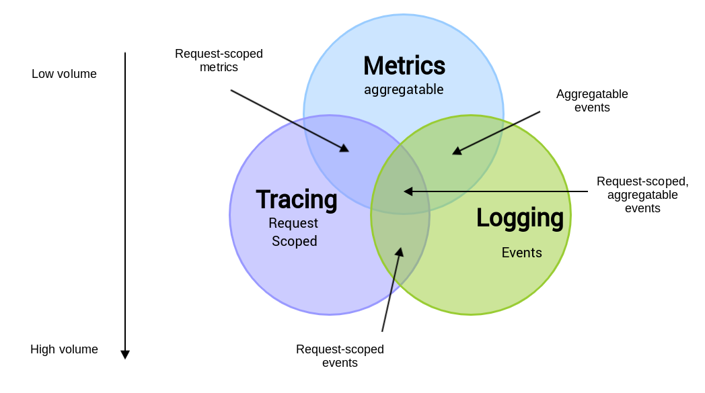
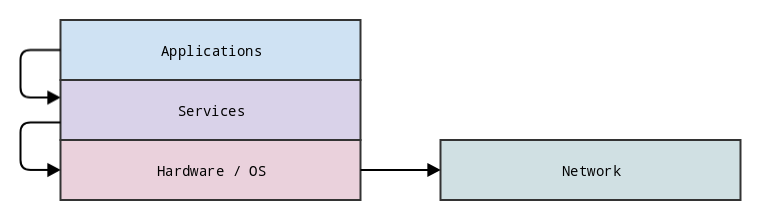
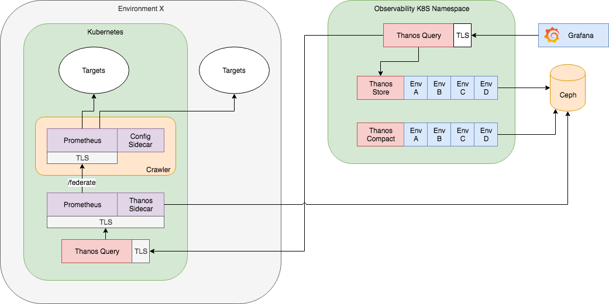

# Building a durable metrics platform with Prometheus and Thanos

[Last time we talked about](https://techblog.cdiscount.com/how-prometheus-helped-roll-out-with-confidence-our-new-mobile-site-to-millions-of-customers/) observability here at Cdiscount, we were still playing a bit with scaling Prometheus to meet our needs and enable our organization access to insights of our IT system. Since we started working on this last summer, we are ready to talk about our achievements in the hope it may help other organizations make the right choices and inspire them to durably change the way they work.

For starter, observability is not only about metrics, it's also about logs, traces and data processing/visualization:



> From https://peter.bourgon.org/blog/2017/02/21/metrics-tracing-and-logging.html

For now, we'll focus on the easiest fruit on the tree, metrics.

Prometheus can scale, we've seen deployments in the wild where some instances can store a few TB on NVMe'd bare metal machines and it will works just fine. And that's a valid way of doing things. But for us, something like this wasn't really feasible with our ever moving distributed environment. After comparing dozen of TSDBs and software solutions, we picked one we thought made the more sense for our company.

## Thanos

Thanos is an Open Source project started by Improbable-Eng, a game engine company. It was love at first sight. Thanos is distributed, highly scalable, and uses object storage for unlimited storage retention. It also comes with downsampling and configurable retention policies. It checked nearly all our boxes and the community was also really growing and eager to accept contributions. 

After a few tests we confirmed the choice and began to deploy Thanos in our datacenters. Using our on-premise Kubernetes clusters built by our Container team, we were able to deploy a production-ready version of Thanos in a few days. On the storage side, we already have Ceph clusters deployed, it was just a matter of adding capacity to it.

Now that we have a platform capable of collecting metrics, we need to expose them!

## 80/20 or Pareto's Law

Trying to design a deployment plan to instrument the whole IT system is not an easy thing. There are instrumentations that will provide value to the many and others to the few. So we started mapping all the components we have and tried to group them in layers, this results in this diagram:



With this map, it's now possible to build a non-exhaustive inventory and sort them by usage/popularity/criticality:


| Application | Service    | Hardware / OS | Network          |
|-------------|------------|---------------|------------------|
| PC Website  | Cassandra  | Linux         | Citrix Netscaler |
| BFFs        | SQL Server | Windows       | Cisco ACI        |
| React SSR   | Ceph       | IPMI          | DNS/NTP          |

And that's where Pareto's Law comes into effect. Which of these components are the most important ? And which would provide the most value while being the easiest to implement ?

The easiest win, was instrumenting our Linux and Windows servers with, respectively, the [node_exporter](https://github.com/prometheus/node_exporter) and the [wmi_exporter](https://github.com/martinlindhe/wmi_exporter) and adding them to our Puppet manifests. In a day or two, 70% of all our servers were exposing their metrics.

A side effect of this deployment, is that the WMI Exporter also exposes metrics from IIS and SQL Server. Though we kept the SQL Server instrumentation on only a few servers to start, the IIS metrics were already proving themselves valuable as we can extract requests, errors and IIS status from all our applications natively.

After a few month, we also instrumented our load balancers with a home-made exporter, added insights in Kafka to track consumer lag and topic stats, monitored Ceph usage and its buckets. At some point, we could instrument a system in a couple of days as we got used to the pattern of finding the best way to instrument, do it, and build dashboards and alerts around. For the easiest systems anyway!

At this point, you might realize that something is missing. We haven't talked about applications yet.

## Instrumenting applications

Being the SRE team, instrumenting the infrastructure is something relatively easy since we manage it. We add exporters to Ansible playbooks, update some Puppet manifests and re-apply the configuration to our servers. One thing we don't control is the applications that are deployed by the developers in our different environments. We worked with our architects and tribes leaders to develop a set of libraries for .NET/.NET Core and Java so that they could be easily integrated and automagically exports standardized metrics that could fit in pre-defined dashboards and alerts.

One thing we're still working on is custom metrics. By default, we blacklist all metrics from entering our systems and only allow a set of predefined metrics (via Prometheus rules and relabelling features). This is to protect the platform from cardinality bombs and other user-caused issues.

We're designing a set of common technical metrics that can be used everyone, and for the others, we are accompanying the teams directly to pick the best type of metric (should it be a histogram ? A counter ? A gauge ?) and in which component should it be created.

One example we could work with is a metric indicating the number of carts created. We need to make sure it's a well named metric, with the right set of labels and that it's only exposed in one component. Imagine if different services were exposing the number of carts from their point of view ? Which metric to trust, display, and alert on ?

At some point, we could come up with this (this is not yet implemented or final):

```
# TYPE counter
# HELP Total number of created carts
cds_order_cart_total{site="PC"} 3330000
cds_order_cart_total{site="Mobile"} 30800
cds_order_cart_total{site="iOS"} 123000
cds_order_cart_total{site="Android"} 4000
```

A discussion we often have is, is this a business metric or a tech one ? Is it needed ? Is it helpful ? Does it belong to the metrics platform or the BI platform ?

One rule we try to follow to answer those questions is that if it helps debug production or provide valuable information at 3am when paged, then it's useful and should be implemented. Adding the new libraries to all our applications, new and old, will take some time and we're still accompanying users for this journey.

## Deploying in Kubernetes

Deploying a single application in Kubernetes is easy, write some YAML, a ConfigMap, a Deployment and off you go. For a complex monitoring solution it is not as simple. There's a few community supported Helm charts but we went another way. We already deploy most of our infrastructure with Ansible, we thought why couldn't we use the same tool we're proficient with, to deploy this new system ?

Thankfully, Ansible provides a `k8s` module that can directly talk to Kubernetes' API. After a few roles and playbooks and more YAML, we were able to test our deployment with [Molecule](https://molecule.readthedocs.io/en/stable/) and [Kubernetes In Docker](https://kind.sigs.k8s.io/) project. This allow easy testing of new features, upgrades and configurations changes directly in our local environment.

Here's our architecture:



We start by deploying our crawler, a Prometheus container with a configuration sidecar reading jobs and rules from Consul. We tag each jobs by their layer (hardware, software, application) and we scale independently each Prometheus as they'll each split the jobs by their number. This allow us to scale our metrics collection pipeline or dedicate some crawlers to a few specific jobs. Aggregations rules are then applied to the collected metrics and exposed through the `/federate` endpoint via TLS.

Each environment gets their dedicated Prometheus and Thanos Sidecar instance. They'll scrape their related crawlers from across the network and Thanos will then write the blocks in our Ceph cluster.

This Ceph cluster is replicated to our other datacenter and the same Kubernetes deployment duplicated to enable high availability in case of outages.

## The Observability journey

Having a powerful and scalable metrics platforms is really handy to have. Be it during incidents or to track what's going on in our systems day to day, it is really an invaluable tool. The Prometheus and Thanos ecosystem is also one of the reasons we went with those software tools as they show a level of maturity and trust in the future of those projects.

Next up in our TODO list is our logging platform. Having learned a lot building the metrics system, we feel like it's time to apply those lessons to our logs and provide our users with a powerful and valuable tool.

Thanks to all the teams at Cdiscount for their support building this project.