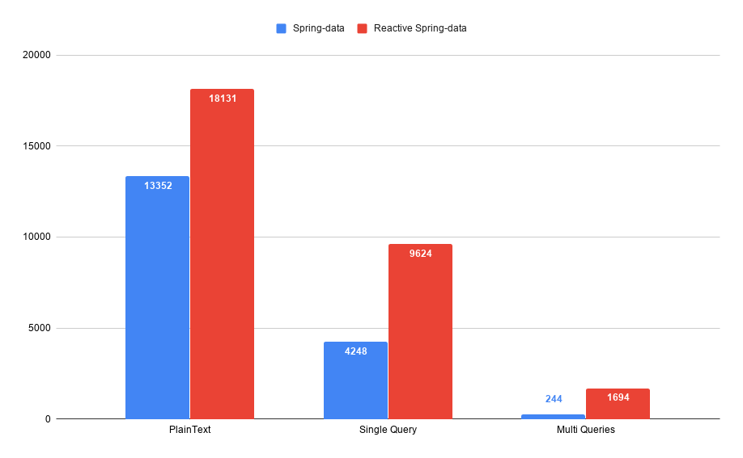
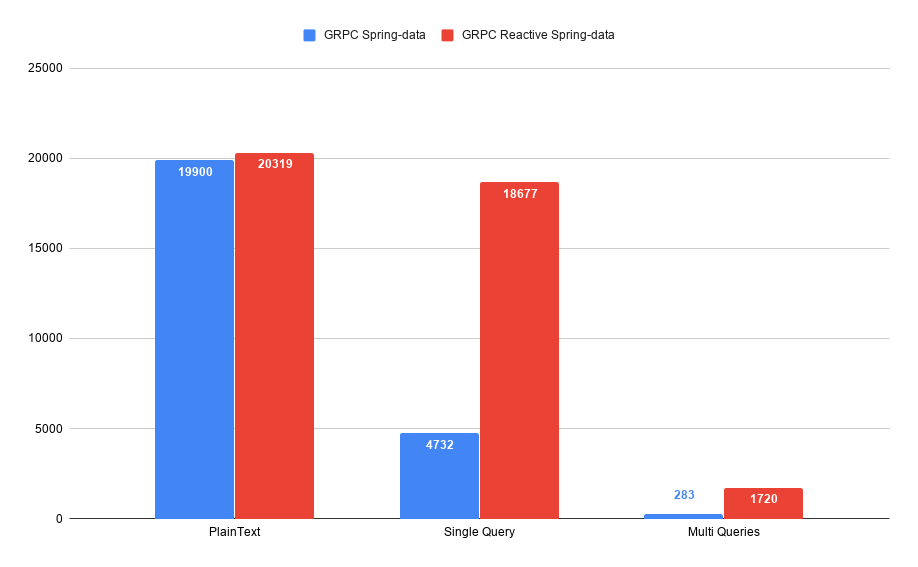
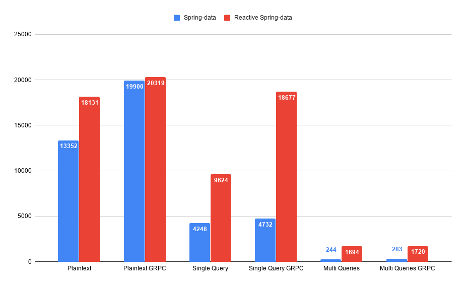

<h1 align="center">
    Frameworks Benchmark
</h1>

    

Si ce genre de considération ne se posait peut-être pas il y a quelques dizaines d’années, nos applications web modernes doivent aujourd’hui, de part leur dynamisme et leur intéractivité accru, gérer de très nombreux types d’évènements afin d’enrichir toujours plus l’expérience utilisateur.

Pour répondre au mieux à ces besoins, il nous faut déterminer quels outils seront les plus adaptés à cette tâche. À CDiscount, nous avons donc décidé d’évaluer plusieurs solutions en réalisant une série de benchmarks pour support.

## Reactive Spring

La première de ces solutions est une fonctionnalité majeure portée par Pivotal à leur framework Spring dans sa version 5 : [Spring-Webflux](https://docs.spring.io/spring/docs/current/spring-framework-reference/web-reactive.html).

Un des éléments cruciaux apporté par Webflux est l’important changement de paradigme vis-à-vis de Spring-MVC au travers des [Reactive Streams](https://www.reactive-streams.org/).

En effet, la [version initial de Spring](https://docs.spring.io/spring/docs/current/spring-framework-reference/web.html#mvc) est traditionnellement construite sur l’API Servlet, utilisant une architecture I/O à blocage synchrone avec un modèle à 1 req/thread,

Webflux à opté, de son côté, pour une approche réactive, non-bloquante, asynchrone, capable de gérer le phénomène de [back-pressure](https://blog.octo.com/les-strategies-de-gestion-de-pression-partie-i/) ainsi qu’un nombre important de connexions concurrentes.

### Qu'est ce que la programmation réactive ?

Il va de soit que les machines sont devenues, avec le temps, de plus en plus puissantes mais qu’en parallèle les applications sont également devenues plus complexes et voraces en ressources, allant jusqu’à dépasser la courbe de croissance des améliorations matérielles...la programmation réactive part de ce simple constat.

L’idée est de proposer au développeur un modèle dans lequel il devient possible de créer des applications répondants aux 4 piliers du [manifeste réactif](https://www.reactivemanifesto.org/fr).

Selon ce dernier un système réactif est :

- **Disponible**

  > _Il doit pouvoir répondre rapidement en toutes circonstances._

- **Résilient**

  > _Il doit rester disponible en cas d’erreur. Ce comportement ne se limite pas aux systèmes critiques, du moment qu’un système n’est plus en mesure de répondre après une panne, il ne s’agit pas d’un système robuste._

- **Élastique**

  > _Il doit rester disponible quelle que soit la charge de travail et doit pouvoir répondre au changement en terme de débit d’entrée en ajustant les ressources allouées à la réponse de ces entrées. Cela requiert une conception du système sans points de contention._

* **Orienté Messages**

  > _Il doit utiliser le passage de messages asynchrones entre ses composants afin de garantir leur couplage faible, leur isolation, la transparence de localisation ainsi que la délégation d’erreurs à d’autres composants._

De façon pragmatique, disons qu’en programmation réactive, tout est flux de données asynchrones, ils sont partout !

    

Il devient en effet concevable de créer des flux à partir de tout et n’importe quoi, absolument toute source de donnée est par essence un flux : les variables, les entrées utilisateurs, les collections, les propriétés, les caches, les structures de données, etc.
En plus de ça il est également possible de combiner des flux, les transformer, les filtrer ou les agréger.

## Première série

> **_A Savoir:_**
>
> - Concernant la conception du bench à proprement parler nous nous sommes grandement inspirés des travaux de [Techempower](http://www.techempower.com/)
> - Nous avons égallement pris le soin d'intégrer dans notre benchmark le framework [ASP.Net Core](https://dotnet.microsoft.com/learn/web/what-is-aspnet-core) de Microsoft, bien connu pour ses excellentes performances, afin d'ajouter un peu de granularité à cette série.
> - **Infra** :
>   **x3 Machines** (Serveur, Client, BDD) ///
>   **OS**: Debian GNU/Linux 9.6 (stretch) ///
>   **RAM**: 3.8 Go ///
>   **CPU**: Intel(R) Xeon(R) CPU E5-2673 v4 @ 2.30GHz / 2 Cores

Ce premier benchmark se décompose en trois tests:

- Un premier effectuant une requête HTTP et retournant simplement une string  
- Un second effectuant une seule query sur la base donnée pour chaque requête HTTP
- Un troisième effectuant vingt queries vers la base de donnée pour chaque requête HTTP

Chaque test est executé pendant 15 secondes avec un pool de 512 connexions.

  

      
  

> _(Résultats exprimés en Req/Secondes)_

Comme on peut peu le constater .Net Core l'emporte pendant le  premier test,  la version Reactive de Spring-Data performe quand à elle sur les tests Single & Multi-Queries.

Seconde donnée intéressante, nous avons également consulté la consommation de Threads par le logiciel _(Seulement pour Spring)_ :

- Spring-MVC :

   

      
  

- Spring-Webflux:

   

      
  

  Résultat sans appel, encore une fois Webflux l'emporte très largement en diminuant le nombre de threads par 10.5 !

## gRPC & Protocol Buffers

Après avoir réalisé cette première série de Benchmark confrontant les performances de Spring-MVC, Spring-Webflux et .NetCore, nous avons voulu aller plus loin en tentant d’augmenter les performances de ces derniers grâce aux deux autres outils que sont Protocol Buffer et gRPC.

- **Protocol Buffer** :

  > [Protocol Buffer](https://developers.google.com/protocol-buffers/) est un format de sérialisation, à l’instar de JSON ou XML, développé par Google. Celui-ci est basé sur un IDL permettant de définir notre structure de donnée, puis de là, de générer le code associé automatiquement. Il a pour caractéristique d’être agnostique , simple, léger, et performant.

- **gRPC** :

  > [gRPC](https://grpc.io/#arrow) est un framework RPC initialement mis au point chez Google avant d’avoir été rendu open source,
  > Il permet de créer des clients et/où serveur rpc et utilise le protocol [HTTP/2](https://blog.eleven-labs.com/fr/http2-nest-pas-le-futur-cest-le-present/).
  > Toutes les données qu’il utilise sont sérialisées et désérialisées via Protocol Buffer et chaque service rpc se déclare donc dans un fichier Protobuf.

  4 modes de communications sont mis à dispostion par gRPC:

  - One-To-One
  - Streaming Client
  - Streaming Server
  - Bidirectional Streaming

## Seconde Série

Comme expliqué ci-dessus, nous avons donc mis en place et implémenté gRPC et Protobuff pour cette seconde série de tests.

    

Encore une fois les résultats sont au rendez-vous et, hormis concernant le test plaintext sur le .Net (surement du à une mauvaise implémentation), les performances des différents frameworks sont boostés par ces outils.

> Vis à vis du nombre de threads utilisés en revanche, gRPC et protocol buffer n'ont simplement aucun impact dessus.

**_Tableau comparatif :_**

    

## Conclusion

> Pour les curieux et ceux qui voudraient faire leurs propres tests, le projet est dispo avec un quick-start sur [**Github**](https://github.com/SouenMazouin/framework-benchmarks).

« Le logiciel ralentit plus vite que le matériel n’accélère » disait Niklaus Wirth en 1995, le problème n'est pas nouveau, et les solutions existantes tels que le modèle réactif non plus, ce qui change, en revanche, c'est l'explosion du nombre d'applications candidates à ce type de modèle.
Néanmoins, si ces systèmes réactifs permettent effectivement une interaction accrue et donc une grande satisfaction de l'utilisateur, il convient de noter qu'il est tout de même nécessaire d'appréhender un nouveau paradigme ainsi qu'un nouveau niveau d'abstraction avant que cela ne devienne naturel... Mais le jeu en vaut la chandelle !
de .
